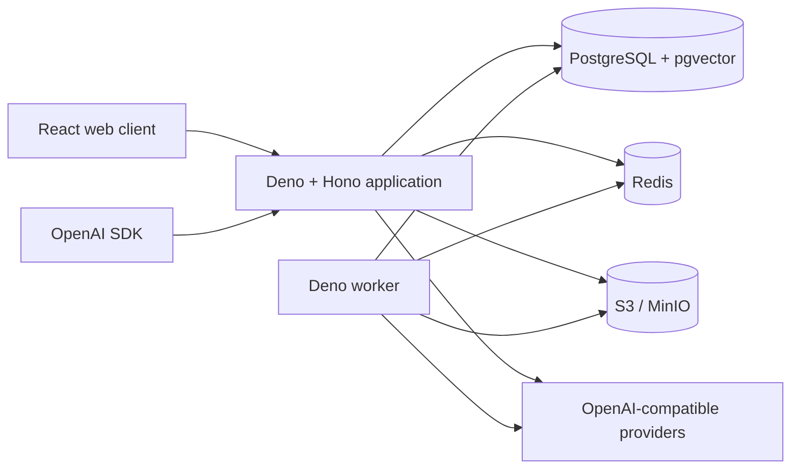

# Architecture

DG Chat is a single-installation, multi-user system. The web client and OpenAI-compatible API share
an application gateway, but use separate contracts: browser features live under `/api/*`;
compatibility endpoints live under `/v1/*`.

## Target runtime topology

The Compose stack provisions the full dependency topology. PostgreSQL is authoritative for the
normalized domain model, durable jobs, accounting, and OpenAI replay state. Redis is on the request
path for distributed rate limits and shared provider circuit breakers. MinIO provides the default
S3-compatible private object store for uploads, OpenAI Files, and ingestion jobs.

- PostgreSQL is authoritative for identity, immutable conversations, accounting, durable jobs,
  configuration, and audit records.
- Redis currently contains disposable rate-limit windows and shared provider circuit-breaker state.
  Presence and ephemeral stream coordination remain planned; correctness must not depend on Redis
  persistence.
- S3-compatible storage owns immutable upload objects. Browser attachment routes and the
  OpenAI-compatible Files lifecycle stream uploads into private objects and authorize every read by
  owner or immutable historical message link. Attachment deletion is a logical tombstone so edits
  cannot break an earlier conversation branch; retention-aware object garbage collection remains
  planned.
- The worker claims durable jobs using `FOR UPDATE SKIP LOCKED`. Handlers must be idempotent and
  retry-safe. Text and JSON attachments use a separate, fenced ingestion state machine that streams
  private objects through byte/time and format validation, then transactionally replaces stable,
  citation-aware chunks. One absolute deadline spans object acquisition, extraction, and chunking,
  leaves a safety margin before lease expiry, and runs PDF/DOCX parsers in a terminable worker
  isolate. Text and JSON use strict UTF-8 parsing; PDF extraction is page-bounded and DOCX
  extraction rejects unsafe archives, macros, encryption, traversal, excessive expansion, and
  external relationships before decompression. Chunk and extractor versions are persisted with page
  or section provenance. Conversation-bound collections support hybrid lexical/vector retrieval or
  bounded full-context injection with persisted source provenance. The OpenAI-compatible embeddings
  endpoint and durable pgvector indexing are implemented for capable provider-registry models. OCR
  interception is implemented with bounded image fetching and a hashed TTL cache. Other Office
  formats, malware scanning, and quarantined-file reprocessing remain planned.

## Core invariants

Messages form a directed acyclic graph. Editing or regenerating appends a node and changes the
user's active leaf transactionally; it never mutates the earlier node. `parent_id` establishes the
path, `supersedes_id` describes edit intent, and a conversation version prevents lost concurrent
updates. Tombstones are explicit nodes/state, not destructive deletion.

Credits use an append-only ledger. A request reserves funds before provider work and settles or
refunds exactly once using an idempotency key. Derived balances are cacheable, while ledger entries
remain authoritative.

API token plaintext is shown once. Only a cryptographic hash, a short preview, scope metadata, and
usage timestamps persist. Admin-managed provider credentials use per-version envelope encryption;
the API decrypts them only while resolving an enabled, effectively priced runtime model. Provider,
model, credential, and append-only price mutations use optimistic versions and atomic audit writes.
Usage reservations snapshot the exact effective price version and all rate categories so later
administrative price changes cannot rewrite historical accounting.

Optional provider diagnostics live outside conversations and accounting records. The current
versioned retention policy is locked while a capture is admitted; scrub previews return exact
request and response cutoff timestamps, and enqueue persists those same timestamps under an
idempotency key. Bounded `SKIP LOCKED` worker batches only null diagnostic bodies and record
terminal audit events, so a policy change or retry cannot expand a previously reviewed deletion
boundary.

## Trust boundaries

All browser input, uploaded content, provider output, tool calls, and fetched URLs are untrusted.
Authorization is evaluated on every object read, not only when signed URLs are created. Provider and
search egress must reject private, loopback, link-local, and metadata-network destinations after
every redirect. Optional code execution is a separate, authenticated service with no default
network, read-only inputs, strict resources, and no Docker socket.

## Availability and observability

`/health` reports process liveness; `/ready` verifies required dependencies. Deployments should
remove an instance from service when readiness fails without restarting it solely for a transient
provider outage. Structured logs carry request, user, conversation, usage-run, and provider-attempt
correlation IDs while excluding secrets and prompt bodies by default. Prometheus metrics,
OpenTelemetry traces, and alert rules remain a planned operational milestone and must not be assumed
present by deployments.

See [SECURITY.md](SECURITY.md) for controls and [DEPLOYMENT.md](DEPLOYMENT.md) for the production
topology.
