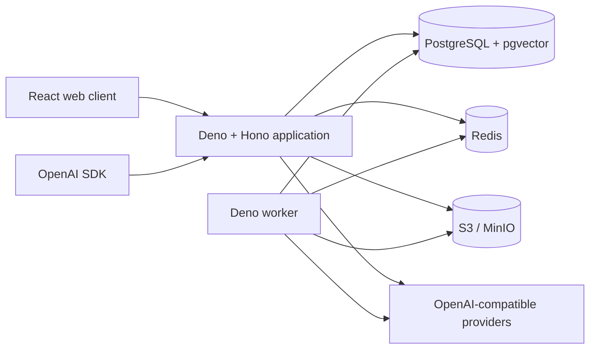

# Architecture

DG Chat is a single-installation, multi-user system. The web client and OpenAI-compatible API share
an application gateway, but use separate contracts: browser features live under `/api/*`;
compatibility endpoints live under `/v1/*`.

## Target runtime topology

The Compose stack provisions the full dependency topology. The current application release uses
PostgreSQL for durable single-instance snapshots and jobs; Redis coordination and S3-backed uploads
are reserved for the next implementation milestone and are not yet on the request path.

- PostgreSQL is authoritative for identity, immutable conversations, accounting, durable jobs,
  configuration, and audit records.
- Redis contains disposable coordination state: rate-limit windows, circuit breakers, presence, and
  stream metadata. Correctness must not depend on Redis persistence.
- S3-compatible storage owns immutable upload objects. Database rows authorize and reference
  objects; messages never own or overwrite object bytes.
- The worker claims durable jobs using `FOR UPDATE SKIP LOCKED`. Handlers must be idempotent and
  retry-safe.

## Core invariants

Messages form a directed acyclic graph. Editing or regenerating appends a node and changes the
user's active leaf transactionally; it never mutates the earlier node. `parent_id` establishes the
path, `supersedes_id` describes edit intent, and a conversation version prevents lost concurrent
updates. Tombstones are explicit nodes/state, not destructive deletion.

Credits use an append-only ledger. A request reserves funds before provider work and settles or
refunds exactly once using an idempotency key. Derived balances are cacheable, while ledger entries
remain authoritative.

API token plaintext is shown once. Only a cryptographic hash, a short preview, scope metadata, and
usage timestamps persist. The current provider credential is environment-only; an admin-managed
provider registry must use envelope encryption before it can be enabled.

## Trust boundaries

All browser input, uploaded content, provider output, tool calls, and fetched URLs are untrusted.
Authorization is evaluated on every object read, not only when signed URLs are created. Provider and
search egress must reject private, loopback, link-local, and metadata-network destinations after
every redirect. Optional code execution is a separate, authenticated service with no default
network, read-only inputs, strict resources, and no Docker socket.

## Availability and observability

`/health` reports process liveness; `/ready` verifies required dependencies. Deployments should
remove an instance from service when readiness fails without restarting it solely for a transient
provider outage. Structured logs carry request, user, conversation, usage-run, and provider-attempt
correlation IDs while excluding secrets and prompt bodies by default. Metrics and traces use the
same identifiers.

See [SECURITY.md](SECURITY.md) for controls and [DEPLOYMENT.md](DEPLOYMENT.md) for the production
topology.
